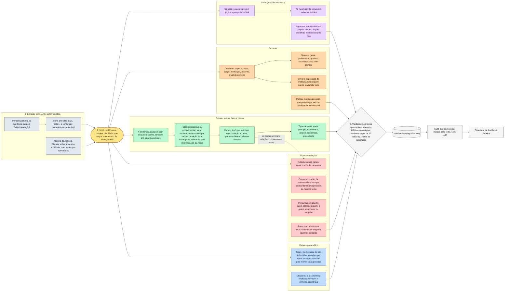

# O que o LLM extrai de cada audiência

Este diagrama mostra o caminho de uma audiência pública desde a transcrição bruta até o arquivo
que o Simulador de Audiência Pública lê. O único passo com modelo de linguagem é o do meio: o
LLM lê a transcrição inteira, já cortada em falas e sentenças numeradas, mais a matéria da
Agência Câmara, e devolve um único JSON que obedece a um contrato de anotação fixo, igual para
todas as audiências (definido em `src/sim/annotate_sim.py`, constante `SYSTEM`).

Tudo o que vem da transcrição é devolvido como índice de sentença, nunca como texto copiado.
Todo texto de autoria do modelo sobre o que alguém disse precisa ser fiel ao trecho: mesmo
sentido, mesmos números, mesmos nomes. O validador confere isso antes de salvar.

Versão editável no FigJam: <https://www.figma.com/board/QnIw0gbj6mhjeHM8TwTD8j>

Imagens: [`extracao-llm-audiencias.svg`](extracao-llm-audiencias.svg) e
[`extracao-llm-audiencias.png`](extracao-llm-audiencias.png).

## Cores

| cor | cluster | o que guarda |
|---|---|---|
| cinza azulado | Entrada | transcrição, corte em falas e sentenças, matéria da imprensa |
| amarelo | Modelo | a única chamada ao LLM |
| roxo | Visão geral | sinopse, o que estava em jogo, pergunta central, leitura da imprensa |
| laranja | Pessoas | oradores, setores, instituições, plateia |
| verde | Debate | temas com eixo pró e contra, falas, cartas e seus tipos |
| vermelho | Grafo de relações | quem apoia, contradiz ou responde a quem, consenso, perguntas em aberto, fatos contestados |
| azul | Ideias e vocabulário | teses defendidas na audiência e glossário |
| cinza claro | Saída | validador, JSON, montagem da cena e o jogo |

## Diagrama

## Leitura rápida, para o vídeo

1. A transcrição é cortada sem LLM em falas (b001, b002...) e sentenças numeradas. Isso é o
   sistema de coordenadas de tudo o que vem depois.
2. O LLM recebe a transcrição cortada e a matéria da imprensa e devolve um JSON só, seguindo um
   contrato fixo.
3. Desse JSON saem cinco famílias de informação: a visão geral da audiência, as pessoas e seus
   setores, o debate (temas, falas e cartas de argumento), o grafo de relações (quem apoia,
   contradiz ou responde a quem, consenso entre setores, perguntas sem resposta e fatos
   contestados) e as ideias (teses defendidas e glossário).
4. As cartas são a unidade que amarra o grafo: cada relação, cada consenso e cada tese apontam
   para cartas concretas, e cada carta aponta para sentenças concretas da transcrição.
5. O validador rejeita o que não bate com o original. Só então o JSON vira o arquivo jogável.
